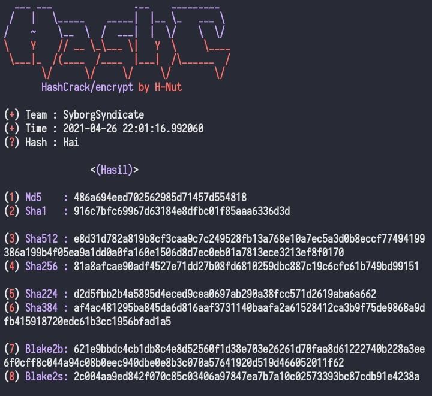

# HashCrack
Hash is a code from encryption which generally consists of random letters and numbers. Hash functions are widely used to speed up searching in data tables or comparing data

# Result

  

